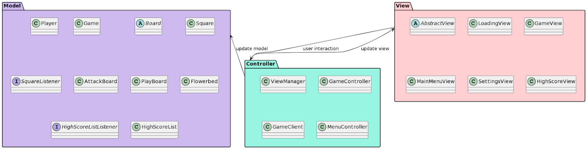
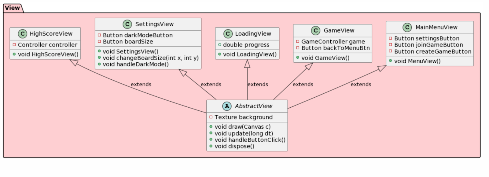
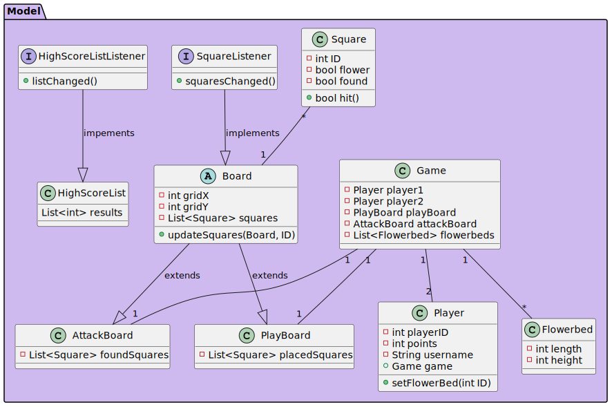
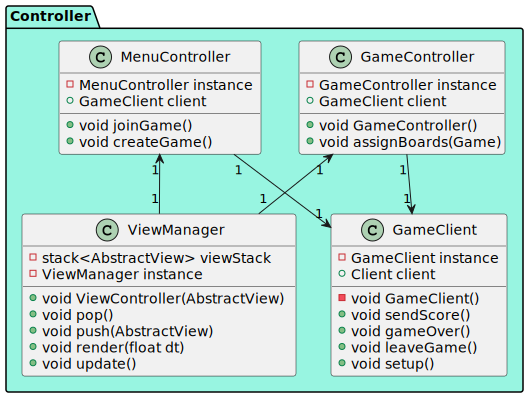
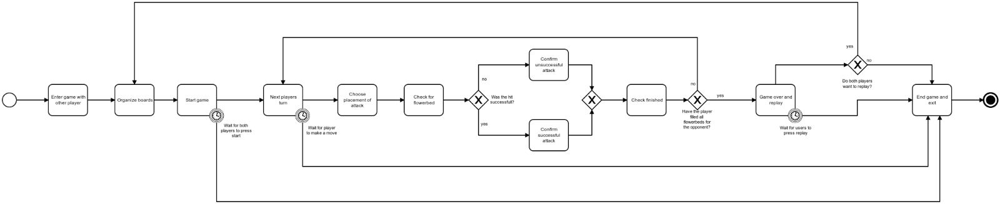
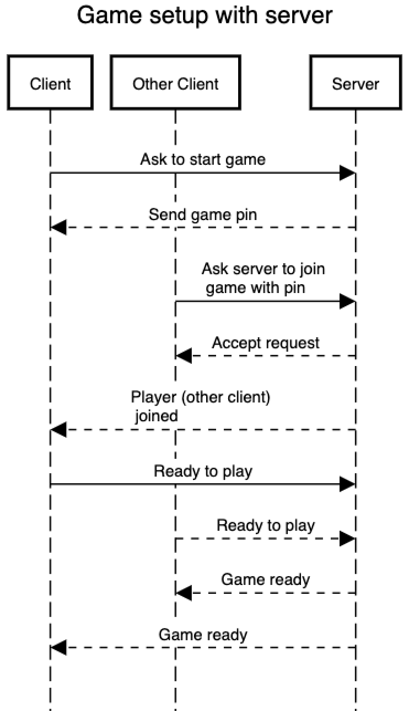
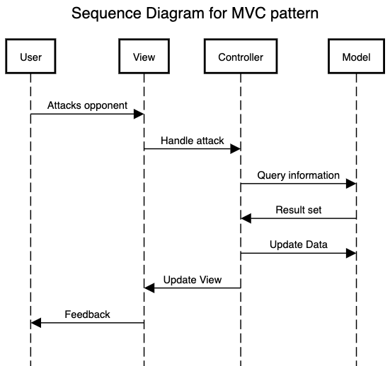

# Flower Power - build your own garden!

Game implementation for TDT4240. 

## Description of gameplay
This game is based on the classic strategy game Battleship. Instead of ships to sink, this game consists of flower beds that will ble planted full of pretty flowers. Each player occupies a grid with flower beds in different lengths and sizes. Each player has a number of beds with different sizes, this is the same for both players. During each turn, the player chooses a square on the opponent's grid to plant. The square either contains a part of a flowerbed, which then will be filled either with flowers or asphalt, which you cannot plant on. When a full flower bed has been planted, it will be revealed on the grid. The first one to fill all of their opponent´s beds with flowers, wins. The garden is now complete!

# Diagrams from archiecural overview

 
 
 
 

# Diagrams for game overview

 
 
 

## Visuals

TODO
Screenshots from the game coming here.

## Installation

TODO
Installation guide coming here.

## Project status

Start of implementation phase
